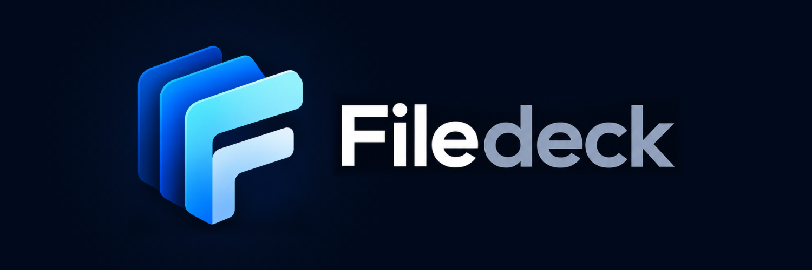

# Filedeck



A web file browser written from scratch as a successor to File Browser — with contracts and tests derived from an analysis of its vulnerabilities. Current features: web interface, accounts with revocable sessions, multiple spaces (the own "My files" space and host directories), per-space permissions, listing, downloading, creating folders, resumable uploads (also by dragging onto the window or a folder), preview of images, video, audio, PDF and text, a text editor with version control, copy and move between spaces (also for multiple selected items), whole-folder uploads, rename, trash, public links to files and folders (with an expiry date and an optional password), notifications with a history of recent operations, light/dark theme, and an interface in English (default) and Polish. Docker is the primary environment. Security model against File Browser's 62 advisories: [SECURITY.md](docs/SECURITY.md). Changes: [CHANGELOG.md](CHANGELOG.md).

The `list`, `read` and `put` commands run with the operating-system operator's privileges and are not an authentication boundary for network users — only `serve` plays that role.

## Docker Compose

Requirements: Docker with Compose v2, a Linux host with kernel 5.8 or newer.

```sh
docker compose up -d --build
docker compose logs filedeck      # address, SHA-256 certificate fingerprint and setup code
```

Open **https://localhost:8443** (`https://` is required) and, on the first start, enter the one-time **setup code** from the log together with the administrator's name and password. The code is random, changes on every start and stops working once an administrator exists. Alternatively, with the service stopped: `printf '%s\n' 'password' | docker compose run --rm -T filedeck bootstrap admin`.

Access from other computers on the network needs an `.env` file — see "Settings" below; without it the port listens only on the host's `127.0.0.1` and a browser on another computer gets "connection refused". By default Filedeck uses a self-signed certificate generated in the state directory (the browser shows a warning — compare the fingerprint with the log). Data: volume `filedeck-data` (`/data/state` — accounts, sessions, certificate, upload and trash registry) and volume `filedeck-files` (`/files/own` — the "My files" space). The administrator adds further users and their space permissions in the interface ("Users").

The container runs as UID 65532, with a read-only filesystem, no capabilities and `no-new-privileges`. Its state (sessions, uploads in progress, certificate) survives `docker compose down`/`up`; `down -v` removes the data volume.

### Management

| Task | Command |
|---|---|
| Reset a password (e.g. a forgotten administrator password) | `docker compose stop` → `printf '%s\n' 'new-password' \| docker compose run --rm -T filedeck reset-password admin` → `docker compose start` |
| Turn off two-factor authentication for someone who lost their phone and recovery codes (e.g. the only administrator; otherwise an administrator does it in "Users") | `docker compose stop` → `docker compose run --rm filedeck reset-2fa admin` → `docker compose start` |
| Update after code changes | `docker compose build && docker compose up -d` |
| Update from a released image (`FILEDECK_IMAGE` in `.env`) | `docker compose pull && docker compose up -d` |
| View logs (including detected spaces and security events) | `docker compose logs -f filedeck` |
| Health | `docker compose ps` (STATUS column: `healthy`) |

Account commands require a stopped service — a running instance locks the state. Without an active administrator the service starts in setup mode (code in the log).

### Released images

The image is built and published to `ghcr.io/pbuzdygan/filedeck` **only when a release is published on GitHub** (`.github/workflows/release.yml`). The branches have separate channels that never mix:

| Branch | Release tag = image tag | Moving tag |
|---|---|---|
| `main` (production) | `X.Y.Z`, e.g. `1.0.0` | `latest` |
| `dev` | `devX.Y.Z`, e.g. `dev0.9.0` | `dev_latest` |

Images are multi-platform: `linux/amd64` and `linux/arm64` (Docker picks the right one).

The workflow rejects a release if the tag has any other format, if the tagged commit is not on the channel's branch (e.g. `1.0.0` on a commit that exists only on `dev`), or if a `main` release is marked as a pre-release. It runs the tests before building. A published version is never overwritten, and `latest`/`dev_latest` move only for the highest version of the channel (a fix to an older version gets only its own number). The image carries a provenance attestation and an SBOM.

Releasing: GitHub → Releases → *Draft a new release* → a new tag (`1.0.0` targeting `main`, or `dev0.9.0` targeting `dev`, preferably as a pre-release) → *Publish release*. To use an image instead of a local build, set `FILEDECK_IMAGE=ghcr.io/pbuzdygan/filedeck:latest` in `.env` (or a specific version such as `:1.0.0`, or `:dev_latest`), then run `docker compose pull && docker compose up -d`. A private package needs `docker login ghcr.io` first.

### Settings

Copy `.env.example` to `.env`. The most important ones:

- `FILEDECK_ORIGIN` — exactly the address you type in the browser (a different `Host` gets 421). For access from the local network: `FILEDECK_BIND=0.0.0.0` and `FILEDECK_ORIGIN=https://<server-IP-or-name>:8443`; the certificate is generated for that name.
- `FILEDECK_FILE_MODE` / `FILEDECK_DIR_MODE` — mode of files and folders created by Filedeck (default `0640`/`0750`, i.e. readable by the group). On SMB mounts the mode comes from the mount options and these settings have no effect.
- `FILEDECK_USER` — UID:GID of the process (default `65532:65532`), see below.
- `FILEDECK_SECRET_KEY` — encrypts the two-factor secrets (AES-256-GCM) and recovery codes (HMAC) in the account database, so a copy of the data volume or a backup alone reveals nothing. Generate it once with `openssl rand -base64 32` and **keep a copy outside the server** (e.g. a password manager). Existing secrets are encrypted on the next start and the database file is rewritten so no unencrypted copy stays in it. A different or missing key later stops the start with a clear message — set the right key, or turn two-factor authentication off for everyone with `reset-2fa`. Instead of the variable, `FILEDECK_SECRET_KEY_FILE` can point to a Docker secret (see `compose.override.example.yaml`); the key is then not visible in `docker inspect`. Without a key everything works, and the log says the secrets are not encrypted.

### Host directories (spaces)

The server mounts shares (SMB/NFS, disks) at its own paths; Filedeck receives them as directories. Every directory mounted in the container under `/spaces/<name>` becomes a space with that name (lowercase letters, digits, `. _ -`). Copy `compose.override.example.yaml` to `compose.override.yaml` — Compose loads it automatically, it is git-ignored, and `compose.yaml` stays untouched on updates:

```yaml
services:
  filedeck:
    volumes:
      - /mnt/nas/shared:/spaces/nas          # space "nas"
      - /srv/archive:/spaces/archive:ro      # browsing and downloading only
```

After `docker compose up -d` the log shows `Space "nas": read-write`. The administrator then grants users permissions for the space in the "Users" panel (a new space is not shared with anyone automatically, except through an "all spaces" grant).

- **Write access.** The process in the container (`FILEDECK_USER`) must be able to write the directory, otherwise the space is read-only (marked in the interface). For an SMB share set the same UID/GID in the mount options (`uid=`, `gid=`), or set `FILEDECK_USER` to the directory's owner. On the first start Filedeck itself creates `/data/state` (`0700`) and `/files/own` (`0750`) as the `FILEDECK_USER` user — the image contains only empty mount points with the sticky bit (like `/tmp`). If you change `FILEDECK_USER` with **existing** data, change its owner once with the service stopped: `docker run --rm -v filedeck_filedeck-data:/data -v filedeck_filedeck-files:/files busybox chown -R 1001:1001 /data/state /files/own` (the Filedeck image has no shell).
- **The `.filedeck` directory.** In every writable space Filedeck creates a hidden `.filedeck` directory (mode `0700`) for files being uploaded and for the trash — they must be on the same filesystem so that publication and moving to the trash are atomic. Filedeck never shows it and does not allow entering it; SMB users may see it — consider hiding it from them (e.g. `veto files = /.filedeck/` in Samba).
- **The trash** of each space is in its `.filedeck/trash`; items are deleted permanently after 30 days or manually by an administrator.
- **Checking a share before use:** `docker compose run --rm filedeck selftest /spaces/<name>` performs, on the mounted directory, every operation Filedeck relies on (publication without overwriting, rename, trash, editor save with version check, copy, search, hiding `.filedeck` including case variants), inside a temporary `filedeck-selftest-*` folder that it removes afterwards. It prints PASS/FAIL and the modes of new files; a non-zero exit code means the directory must not be used for writing. It does not need the state directory, so it runs next to a running service.
- **Filesystem requirements:** `renameat2(RENAME_NOREPLACE)` (local disks, CIFS/SMB; NFS does not support it — publication returns an error instead of risking an overwrite). Support for specific SMB/NFS servers has not been tested yet.

### Behind a reverse proxy (production)

The proxy (Nginx Proxy Manager, Caddy, Traefik, nginx) terminates TLS with a real certificate and talks plain HTTP to Filedeck. Two settings in `.env`:

```sh
FILEDECK_ORIGIN=https://files.example.org   # the address people open
FILEDECK_PROXY_CIDR=172.18.0.1/32           # where Filedeck sees the proxy connect from
```

Setting `FILEDECK_PROXY_CIDR` switches off Filedeck's own certificate by itself (`FILEDECK_TLS_SELF_SIGNED` can stay empty). Which address to trust depends on how the proxy reaches Filedeck:

| The proxy forwards to | `FILEDECK_PROXY_CIDR` | In Nginx Proxy Manager |
|---|---|---|
| the server's IP and the published port (`ports: "8543:8443"` — e.g. when 8443 is taken on the host) | the gateway of Filedeck's Docker network, e.g. `172.18.0.1/32` (computers on the LAN connect with their own address and are refused) | scheme `http`, host `192.168.1.10`, port `8543` |
| the container directly, both in the same Docker network (no `ports:` needed) | the proxy container's address, e.g. `172.18.0.5/32` | scheme `http`, host `filedeck`, port `8443` |

**Not sure which address?** Put anything there, open the site through the proxy and look at `docker compose logs filedeck`: the line `untrusted_proxy client=172.18.0.1 … set FILEDECK_PROXY_CIDR=172.18.0.1/32` gives the exact value. At start the log also says `Behind a reverse proxy: plain HTTP on :8443, accepted only from …`. Opening Filedeck by IP address instead of its name returns `unexpected_host` with the expected address — use the name from `FILEDECK_ORIGIN`.

The address of public links is built from `FILEDECK_ORIGIN` — set it to the address under which recipients of links can reach Filedeck. Connections from outside `FILEDECK_PROXY_CIDR` are rejected. Identity comes only from the session; `X-Forwarded-For` is read only from the trusted proxy and only to find the visitor's address for rate limits and the security log (it is read from the right, skipping hops inside the CIDR, so an address a visitor adds themselves is never used).

Checklist for the proxy:

- pass the original `Host` header and set `X-Forwarded-For` (nginx: `proxy_set_header X-Forwarded-For $proxy_add_x_forwarded_for;` — Nginx Proxy Manager, Caddy and Traefik do this by default);
- trust only the proxy's address in `FILEDECK_PROXY_CIDR` (a `/32`), not a whole network — then a published port cannot be used to bypass the proxy: other connections get `untrusted_proxy`;
- allow request bodies of at least 16 MB (an upload chunk is 8 MiB) and long read timeouts, so large downloads are not cut off;
- access logs of the proxy contain public link tokens (`/s/<token>`, `/api/public/<token>`): keep them private or mask these paths;
- HSTS: Filedeck sends `Strict-Transport-Security: max-age=31536000` itself (without `includeSubDomains`); enabling it in the proxy as well is harmless.

### Security log

Sign-ins and security-relevant changes are written to the container log, one line each, with the visitor's address — passwords, codes and tokens never are:

```
time=… level=WARN msg=login_failed client=203.0.113.5 user=anna reason=password
```

Events: `login`, `login_failed` (`reason=password|code|code_locked`), `logout`, `rate_limited`, `reauth_failed`, `password_changed`, `password_reset`, `user_created`, `user_updated`, `user_deleted`, `setup_failed`, `setup_completed`, `totp_enabled`, `totp_disabled`, `totp_recovery_codes_renewed`, `totp_reset`, `link_created`, `link_revoked`, `link_unlock_failed`, `untrusted_proxy`. A sign-in with a recovery code is logged as a warning (`recovery_code=true`). For fail2ban or CrowdSec, match `msg=(login_failed|link_unlock_failed|setup_failed) client=<HOST>`.

Every CLI flag has a `FILEDECK_<NAME>` equivalent (e.g. `FILEDECK_TLS_CERT`, `FILEDECK_TLS_KEY` for your own certificate); a flag takes precedence over the variable.

## Running without Docker (development)

Requirements: Linux with `openat2` and `statx(STATX_MNT_ID)` (kernel 5.8 or newer), an accessible `/proc/self/fd`, Go 1.27.1. The target filesystem must support `renameat2(RENAME_NOREPLACE)`, `flock` and directory sync. If a required mechanism is missing, Filedeck fails instead of falling back to something less safe.

From the repository root:

```sh
go build -o bin/filedeck ./cmd/filedeck
mkdir -p demo/files demo/state
chmod 700 demo/state
printf 'First Filedeck file\n' > demo/source.txt
./bin/filedeck -root demo/files -state demo/state put demo/source.txt hello.txt
./bin/filedeck -root demo/files -state demo/state list
./bin/filedeck -root demo/files -state demo/state read hello.txt
```

Additional spaces: `-spaces-dir DIR` (every subdirectory is a space), and `-space NAME` selects the space for `list`/`read`/`put`. The state directory must be outside all spaces.

Uploading to `hello.txt` again returns a conflict and keeps the previous content. Nested targets work if the parent directory already exists. Paths relative to a space use `/`; `.` means the root, for listing only.

## Server and API

The first administrator is created locally only; the API has no open registration and no header-based login. The password (min. 12 characters) is read from the terminal or stdin. Account commands require a stopped server (state lock).

```sh
./bin/filedeck -root demo/files -state demo/state bootstrap admin
./bin/filedeck -root demo/files -state demo/state \
  -listen 127.0.0.1:8080 -origin http://127.0.0.1:8080 -insecure-local serve
```

The web interface is at `-origin`. `-insecure-local` allows HTTP on a loopback address only, for development. Otherwise `-origin https://…` is required, plus TLS (`-tls-cert`/`-tls-key` or `-tls-self-signed`) or an explicit `-proxy-cidr` of a reverse proxy terminating TLS. Behind the proxy, `X-Forwarded-For` from `-proxy-cidr` determines the visitor's address for rate limits and the security log only. `-origin` must match the browser address exactly; a different `Host` gets 421.

| Method and path | Description |
|---|---|
| `POST /api/auth/login` | `{"username","password","code"}` → session cookie and `csrf` token; an account with two-factor authentication gets 401 `totp_required` after a correct password without `code` (a 6-digit code or a recovery code) |
| `GET /api/auth/me`, `POST /api/auth/logout` | current session with the `csrf` token and upload limits, logout |
| `POST /api/auth/password` | change password, revokes all sessions of the account |
| `GET /api/auth/totp`, `POST /api/auth/totp/setup`, `POST /api/auth/totp/enable`, `POST /api/auth/totp/recovery`, `POST /api/auth/totp/disable` | own two-factor authentication: state and recovery codes left; a new secret (`{"password"}` → `key`, `uri`, `qr`); turning on with the first code (`{"code"}` → `recovery_codes`, other sessions end); new recovery codes and turning off (`{"password"}`) |
| `GET /api/spaces` | the user's spaces with their permissions (an administrator sees all) |
| `GET /api/files?space=&path=` | listing (`.` or missing = root of the space) |
| `POST /api/folders` | `{"space","path"}` — new folder in an existing directory, never overwrites |
| `POST /api/rename` | `{"space","from","to"}` — rename/move within a space, never overwrites |
| `GET /api/search?space=&path=&q=` | search by name below a folder (case-insensitive), max. 500 results, 200,000 scanned entries, 10 s — `truncated: true` when a limit is reached |
| `GET /api/preview?space=&path=` | inline preview for a fixed list of types only (images, video, audio, PDF), `nosniff`, CSP `sandbox` |
| `GET`/`PUT /api/text` | editor: `{"content","version"}`; saving with `version` replaces the file only in that version (409 `changed`), an empty `version` creates a new file; limit 2 MiB UTF-8 |
| `POST /api/transfers`, `GET /api/transfers[/{id}]`, `DELETE /api/transfers/{id}` | background copy/move: `{"kind":"copy"\|"move","from":{space,path},"to":{space,path}}` or `"items":[{from,to},…]` (up to 1000, one after another, the first error stops), progress, cancellation |
| `POST /api/trash`, `GET /api/trash?space=` | move to trash, trash contents |
| `POST /api/trash/{id}/restore`, `DELETE /api/trash/{id}` | restore (`{"path"}`, empty = original), permanent deletion — administrators only |
| `GET /api/content?space=&path=` | download as an attachment, single `Range` |
| `POST /api/uploads` | `{"space","path","size"}` → upload ID |
| `PATCH /api/uploads/{id}` | `application/octet-stream` chunk, `Upload-Offset` header |
| `GET`/`DELETE /api/uploads/{id}`, `POST /api/uploads/{id}/commit` | status (`state`, confirmed `offset`), cancellation, publication — a repeated commit returns the stored result |
| `GET`/`POST /api/users`, `PUT`/`DELETE /api/users/{id}`, `POST /api/users/{id}/password`, `DELETE /api/users/{id}/totp` | administration; changes require `reauth_password`; deleting ends the account's sessions and removes its public links (not allowed for your own account or the last administrator); `…/totp` turns off someone's two-factor authentication and ends their sessions |
| `POST /api/links` | `{"space","path","expires_in_hours","password"}` → `url` of the public link (shown only once) |
| `GET /api/links[?all=1]`, `DELETE /api/links/{id}` | own links with their `available` state (administrator: all), revocation |
| `GET /s/{token}`, `GET /api/public/{token}[/files?path=\|/content?path=]`, `POST /api/public/{token}/unlock` | link page and API without signing in: information, folder listing, download, unlocking with a password |

Every request other than GET/HEAD requires an `Origin` header equal to `-origin` and the `X-CSRF-Token` from the login response. Permissions are a per-space bit mask (`"spaces": {"files": 15, "*": 3}`; `*` = all spaces): 1 list, 2 read, 4 create (upload, folders), 8 modify (rename, trash, restore).

An upload survives a restart and even a server crash: after a lost response or connection the client asks `GET /api/uploads/{id}` for the confirmed `offset` and continues from there. If the commit response was lost, the client repeats the commit or checks the status (`state: "published"`) — for 24 h it gets the same result, with no risk of a second publication. Sessions are persistent too, so the cookie keeps working after a restart.

## Implemented contracts

- Web interface embedded in the binary: only same-origin resources, no inline scripts or styles, Trusted Types (no `innerHTML`), file names inserted as text, CSRF token kept only in memory, files always downloaded as attachments.

- Access to spaces through handles, rejecting traversal, symlinks and crossing into nested mounts.
- Only regular files are read; the type is checked through `O_PATH` before opening the data. Listing skips symlinks and special files and limits the number of processed entries.
- Independent list, read, create and modify permissions, granted per space; denied by default. The owner of an upload is checked on every operation on it.
- The hidden `.filedeck` directory of each space is unreachable also through name aliases (letter case, trailing dots/spaces, another name for the same directory — device and inode are compared). A read-only space is detected automatically.
- Rename, trash and restore use `renameat2(RENAME_NOREPLACE)` — they never overwrite; permanent deletion only from the trash, without following symlinks and without crossing mounts.
- Private staging, limits on file size, chunk size, reserved bytes and the number of uploads globally and per user.
- The offset check and the chunk write are serialized; rollback after an error, a limit breach or cancellation.
- Permissions, completeness and size are checked again before publication. A new name is created atomically without overwriting an existing file, directory or symlink.
- Cleanup removes only its own staging file. A failure to confirm durability after publication is distinguished from a failed publication.
- Durable upload records: the offset is written after the data is fsynced, two-phase publication is resolved after a restart by the presence of the staging file, the commit is idempotent with its result kept for 24 h. Expiry and cancellation remove the staging file and the record; staging files without a record are removed at startup.

- Accounts and sessions in a transactional bbolt database in the private state directory; Argon2id passwords; random sessions stored as hashes, with idle (30 min) and absolute (12 h) expiry, max. 8 per account. A password change, reset, account disable or permission change revokes all sessions of the account; the last active administrator cannot be disabled or demoted.
- `__Host-` cookie, `HttpOnly`, `Secure`, `SameSite=Strict`; CSRF protection through a session-bound token, an exact `Origin` and `Sec-Fetch-Site`. Login limits per address and globally, a limit on concurrent requests, a 60 s deadline (downloads keep going while data flows), JSON and header limits, strict JSON and query parsing.
- Upload publication is serialized with logout and account changes: after a successful logout or disable, an old request cannot publish a file. Downloads started earlier may finish.

Defaults: file 1 GiB, chunk 8 MiB, staging 4 GiB, 32 active uploads, 4 per user, validity 1 hour. These are prototype limits, to be tuned for the product. The internal model allows many chunks; the CLI splits a local file automatically.

## Translations

Interface texts live in `internal/web/static/lang-en.json` (default, source) and `lang-pl.json`. A new text is added to **both** files; `TestTranslations` (part of `go test ./...`) checks that the languages have the same keys and placeholders (`{name}`), and that every key used in HTML/JS and every API error code has a translation. A new language: another `lang-<code>.json` file plus an entry in `LANGS` in `app.js`/`share.js` and in the test.

## Tests

```sh
go test -count=1 -timeout=60s ./...
go vet ./...
go test -race -count=1 -timeout=120s ./...
go test ./internal/storage -run='^$' -fuzz=FuzzValidPath -fuzztime=10s -parallel=2
```

The race detector needs a C compiler; without one, use the `golang:1.27.1-bookworm` image. The `Makefile` also has `build`, `test`, `race`, `vet`, `fuzz` and `ui-test` targets.

The browser test (Chromium through Playwright, in the prebuilt Playwright image) runs against a **throwaway** instance with empty volumes — it creates folders, files, links and the user `jan`. With an instance at `https://localhost:18443` and an administrator `admin`:

```sh
FILEDECK_URL=https://localhost:18443 FILEDECK_ADMIN=admin FILEDECK_PASSWORD='admin-password' make ui-test
```

A complete recipe for the throwaway instance is in [AGENTS.md](AGENTS.md).

Security model and limitations in detail: [CONTRACT.md](docs/CONTRACT.md). Status and next steps: [PROGRESS.md](docs/PROGRESS.md).
